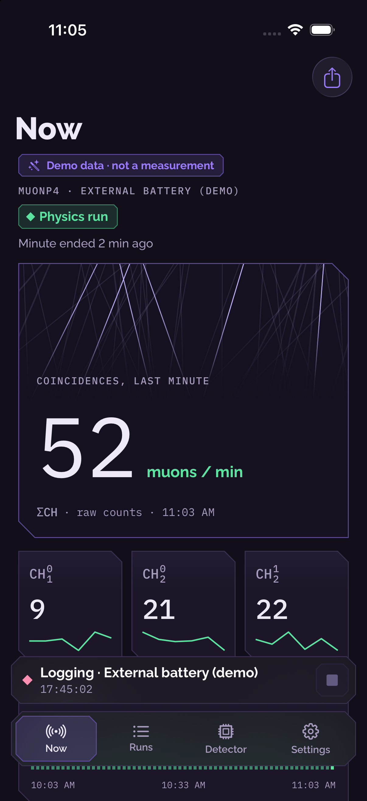
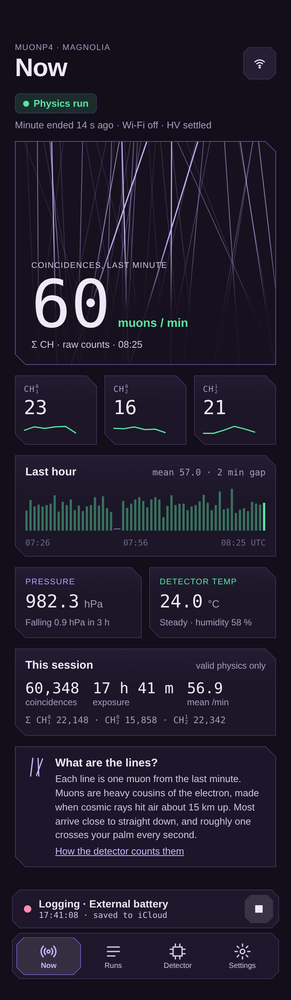
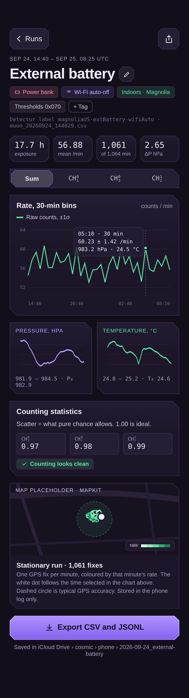
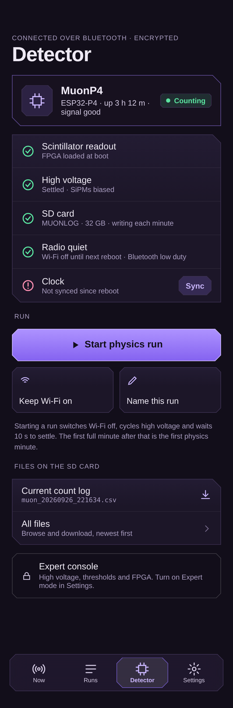
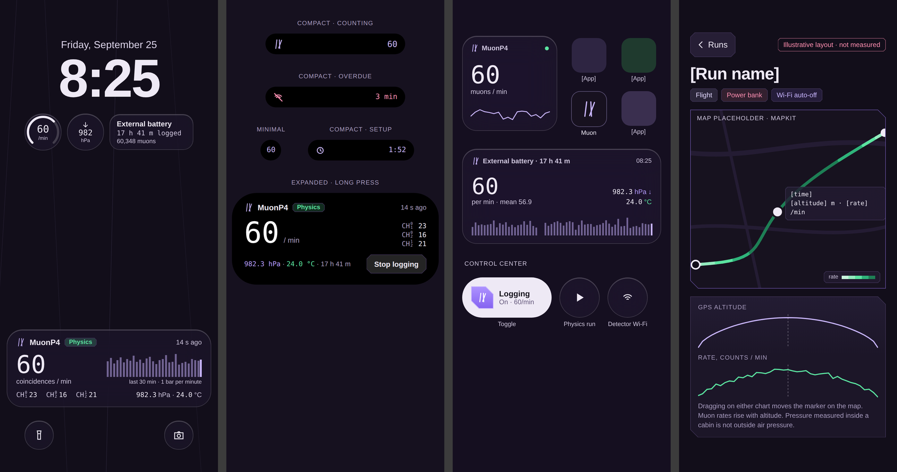

# gLowCost iOS: MuonP4 monitor

An iPhone app for the **gLOWCOST MuonP4** cosmic-ray muon telescope. It pairs with the detector over Bluetooth, logs every minute of counts with pressure, temperature and GPS, keeps a history of runs, and shows the live rate on the Lock Screen, in the Dynamic Island and in widgets.

## Navigation update — 2.1 build 4

Logging status and the stop button now live inside **Now**, not above the bottom tabs. Both tab-bar styles reserve extra scroll room so the final controls remain visible. Tap the selected tab again to scroll the current page to the top without discarding its navigation or edits.

Simulator UI tests cover both the system and custom bars: Now-only logging, bottom control clearance and repeat-tab scrolling. [Bottom-control screenshot](docs/screenshots/system-tabs-bottom-simulator.png).

## New in 2.1 — recovery and measurement metadata

- **Reconnect safely:** verify and save each recovered minute individually, retry missing SD records without blocking later records, and include previous boot journals. Recovered data fill the live charts and widgets.
- **GPS continues during Bluetooth gaps.** Retained timestamped fixes can be matched to recovered measurements. Assign a stationary location to a selected time range where GPS is missing, including minutes recovered later.
- **Both copies can carry location:** send GPS/manual observations back to the detector's SD companion file with acknowledged, repeat-safe uploads. The detector always operates without a phone.
- **Full measurement context:** preserve DAC0–7, HV command/state, humidity, UTC and monotonic time, sync metadata, raw/physics cumulative counts, radio flags, firmware revision and FPGA hash in imports and exports.
- **Clearer layouts:** all-pair run charts, whole-run statistics, a session sum, unobstructed bottom controls, and matching Lock Screen/Dynamic Island legends. Pressure and temperature (with units) share the channel-count row. The app icon uses the existing muon glyph.

The deployment is **v2.2 with three connected paddles**, fourth channel unconnected. See [schema 5, examples and scientific limits](docs/RECORD-SCHEMA-5.md). Extended metadata and GPS-on-SD require the matching firmware update; the existing version-4 BLE layout remains compatible. No GPX or Health imports are required.

Core tests and signed iPhone builds pass. The new firmware has not been flashed in this update; background recovery, migration and physical-device layout checks remain pending.

<p></p>

*Current simulator capture with synthetic data. The images below are design mockups.*

<p align="center">
  
  
  
</p>
<p align="center">
  
</p>

<sub>Design mockups, rendered before the final review fixes and with fallback fonts. See <a href="design/">design/</a>.</sub>

## Live logging and layout update — September 27, 2026

- Run charts show the sum and all three coincidence pairs together with a legend. Run cards wrap tags; bottom navigation reserves its actual height.
- The Now screen has simpler environment labels, compact exposure units and an explicit session sum. Counting statistics use the entire run's physics minutes.
- Missing minutes trigger automatic SD recovery when Bluetooth is available, with retries after failed transfers. Imports refresh the last-hour chart, Live Activity and widgets.
- GPS remains active while logging, including Bluetooth outages when iOS permissions allow. Timestamped fixes are retained locally per run and matched to recovered minutes; a current location is never substituted for an old missing fix.
- The Home Screen icon uses the existing muon glyph.

These updates require on-device checks for scrolling, background GPS and reconnection recovery.

## Latest build update — September 27, 2026

- Simulator and iPhone builds pass in Xcode; a fresh signed Debug iPhone build completed without warnings.
- Widget and Live Activity text now uses interpolation compatible with iOS 26, preserving colours and relative-time display.
- Debug builds skip stripping the already-signed widget extension during embedding. Release settings are unchanged; the project generator preserves the fix.
- Core host tests pass. Live Bluetooth, GPS, Live Activity and Dynamic Island behaviour still need on-device verification.

## Live Activity and run chart update — September 27, 2026

- **Lock Screen Live Activity and expanded Dynamic Island** share one compact layout: rate with `/min` beside it, a wider, taller 30-minute pair-line plot (no caption, so it uses the full height), and one row with the three channel counts on the left and pressure · temperature (units kept) on the right. The sample age is right-aligned; Stop sits on its own row in the Island.
- **Run rate chart:** the legend uses the same colour over/underlined CH labels as the Live Activity; Σ is enlarged to match CH with its paddle digits; the y-axis fits the rates and error bars with 8% headroom instead of rounding up to the next round number.
- Not yet compiled in this update's environment; layout on the user's iPhone still needs checking.

## What gLowCost / MuonP4 is

gLOWCOST is a low-cost muon telescope: plastic scintillator paddles read by SiPMs, coincidence logic in a small FPGA, and an ESP32-P4 board that counts, logs to an SD card and measures temperature and pressure. **MuonP4** is the detector's firmware and Bluetooth name. Every minute it reports the coincidence counts of three paddle pairs (CH⁰₁, CH⁰₂, CH¹₂), the triple, three raw inputs, and the environment. A minute only counts as *physics* when Wi-Fi is off and high voltage has settled.

The firmware lives in its own repository ([ESP32-P4-gLOWCSOT-cubesat](https://github.com/sawaiz/ESP32-P4-gLOWCSOT-cubesat)). This repository is only the iPhone app.

## Features

| Area | What you get |
|---|---|
| **Now** | The last minute drawn as muon tracks, the count in big numbers, the three pairs, the last hour (one green bar per minute, gaps visible), pressure with 3-hour trend, detector temperature, session totals, a counting-statistics check |
| **Runs** | Every logging session saved on the phone. Summary header ("6 runs · 79 h of physics"), tag filters, search, rename, tags, notes, compare two runs, import SD-card CSVs |
| **Run detail** | Rate chart (1/10/30/60-min bins, ±1σ, event markers, scrub readout), pressure, temperature and altitude, GPS track coloured by rate, counting statistics, SD gap fill, CSV export |
| **Detector** | Connection, health checklist, Start physics run, keep Wi-Fi on, clock sync, SD files (downloads import automatically) |
| **Expert console** | HV byte, DAC channels, FPGA reload (bitstream name when reported), raw counters, radio diagnostics (needs firmware), telemetry (Settings › Expert mode) |
| **Saving** | Pick iCloud Drive › `cosmic` once; each run is written to `cosmic/phone/<date_name>/minutes.csv` and `run.json` every 5 minutes |
| **Outside the app** | Live Activity with Stop button and a three-pair line chart, Dynamic Island, Home and Lock Screen widgets, Control Center toggle and Physics-run button, Siri and Shortcuts |
| **Alerts** | Local notifications: updates stopped (after N minutes, you choose), zero coincidences, sudden jump, SD card problem, noisy counting |
| **Demo** | No detector? **Try the demo instead** on the pairing screen, or run the `MuonMonitor Demo` scheme |

Counts are always **raw**. The app applies no pressure or temperature correction: the detector compensates SiPM bias for temperature itself, and pressure and temperature are stored with every minute for later analysis ([why](docs/HISTORY.md)).

No server, no paid Apple Developer membership, no third-party packages.

## Requirements

- A Mac with **Xcode 27** (iOS 26 SDK).
- An iPhone on **iOS 26** or later for Bluetooth. The Simulator runs the demo. Dynamic Island needs an iPhone 14 Pro or newer.
- A **free Apple ID** is enough (Personal Team).
- Optional: Python 3 (preinstalled on macOS) to regenerate the Xcode project.

## Build and run

```sh
git clone https://github.com/muonTelescope/gLowCost-iOs.git
cd gLowCost-iOs
python3 tools/generate_project.py        # optional: the project is committed, this refreshes it
cp MuonMonitor/Config.local.xcconfig.example MuonMonitor/Config.local.xcconfig
open MuonMonitor/MuonMonitor.xcodeproj
```

1. **Set your team and bundle ID.** In `MuonMonitor/Config.local.xcconfig` (git-ignored) set `MUON_TEAM` to your team ID (Xcode › Settings › Accounts › your Apple ID › Personal Team) and `MUON_BUNDLE_ID` to something unique such as `com.yourname.muonp4`. Alternatively pick the team under Signing & Capabilities for both the **MuonMonitor** and **MuonLive** targets.
2. **Try it without hardware:** choose the **MuonMonitor Demo** scheme, an iPhone simulator, and press Run. It starts with two synthetic runs marked "Demo data".
3. **Run on your iPhone:** choose the **MuonMonitor** scheme and your phone. Turn on Developer Mode on the phone (Settings › Privacy & Security) the first time, and trust your certificate under Settings › General › VPN & Device Management.
4. In the app: Settings › Saving › Folder → **iCloud Drive › cosmic**.

**If Xcode cannot register the App Group** (an error mentioning `group.…`), uncomment the three empty App Group lines in `Config.local.xcconfig`. Everything still works except that Home Screen widgets and the Control Center toggle cannot see live data. The Live Activity and Dynamic Island don't need the group.

Free-account limits: reinstall from Xcode every 7 days; at most 3 such apps per device.

After adding or removing Swift files or fonts, run `python3 tools/generate_project.py` again. Keep generated project settings in `tools/generate_project.py`; shared configuration lives in `MuonMonitor/Config.xcconfig` and personal signing overrides belong in the git-ignored `Config.local.xcconfig`.

## Pair with the detector

1. Power the detector. It advertises as **MuonP4** about every 15 seconds.
2. Open the app › **Find a detector**. When MuonP4 shows up, tap **Connect and pair**. iOS may ask to pair; pairing encrypts detector commands.
3. Allow location so each minute carries its GPS fix (optional, stays on the phone and in your folder).
4. The first minute arrives within about two minutes. For the first 120 s after boot the detector keeps Wi-Fi on for setup; **Detector › Start physics run** skips that wait.

More in the [user guide](docs/USER-GUIDE.md).

## Project structure

```
MuonMonitor/
  App/            the iPhone app
    Core/         pure Swift: minute records, SD parsing, health, binning, CSV (host-tested)
    Model/        SwiftData models, tag catalogue
    Services/     Bluetooth link, app state, location, cosmic folder, alerts, Live Activity, demo data
    Views/        SwiftUI screens
    Intents/      Siri / App Shortcuts
  Shared/         compiled into the app and the widget: design tokens, glyphs, activity state, intents
  Widget/         Live Activity, Dynamic Island, widgets, Control Center (MuonLive extension)
  Resources/Fonts Raleway and IBM Plex Mono (SIL OFL 1.1) with their licences
  Config.xcconfig bundle ID, team, App Group
tools/generate_project.py   regenerates MuonMonitor.xcodeproj and the two schemes
tests/            host tests (C encoder from the firmware + Swift core)
design/           mockups, redesign plan, review, design system
docs/             protocol, user guide, data format, history
```

## Design system

"Violet & phosphor", dark only: violet ground and structure, lilac muon tracks, **phosphor green for anything that is data**, pink only for alerts and destructive actions. Raleway for words, IBM Plex Mono for numbers. Cut (chamfered) corners with a 1 px hairline that follows the cut; frosted glass only on the floating tab and logging bars and the chart readout. All tokens are in `MuonMonitor/Shared/` (`Palette.swift`, `Typography.swift`, `Chamfer.swift`, `Glyphs.swift`). Details: [design/DESIGN-SYSTEM.md](design/DESIGN-SYSTEM.md).

Two switches:

- `useSystemTabBar`: Apple's Liquid Glass tab bar instead of the custom bars (Settings › Debug in Debug builds, or `defaults write <bundle id> useSystemTabBar -bool YES`).
- `ChannelLabel.minDigit`: minimum size of the channel digits.

## Data storage

- On the phone: SwiftData (runs, minutes, events). Demo mode uses a separate in-memory store and never touches your runs.
- In your folder: pick **iCloud Drive › cosmic** once (security-scoped bookmark, no iCloud entitlement needed). Each run goes to `cosmic/phone/<yyyy-MM-dd_HHmm_name>/minutes.csv` (raw counts, pressure, temperature, GPS for every minute) and `run.json` (name, tags, notes, events), every 5 minutes and when logging stops.
- SD-card logs (`muon_….csv`, and `env_….csv` from older firmware) import from Files or from anywhere in the folder. See [docs/DATA-FORMAT.md](docs/DATA-FORMAT.md).

## Testing

```sh
tests/run-host-tests.sh
```

It builds the firmware's C telemetry encoder, writes a reference packet, and decodes it with the app's Swift decoder. Then it tests the pure-Swift core: run-label sanitising (mirrors the firmware), SD parsing for old and new firmware, gap filling, health statistics, binning and CSV export. Needs `cc` and `swiftc` (Xcode command line tools on macOS, or a swift.org toolchain on Linux).

Hardware checklist:

1. Pair and start logging. The first minute appears within about 2 minutes, and the setup countdown shows in the Dynamic Island.
2. Rename the live run to "Test run". The detector's status shows label `Test_run`, and the SD file name ends in `_Test_run.csv`.
3. Lock the phone for 30 minutes. The Live Activity updates each minute.
4. Walk out of range for longer than the "Alert when updates stop" time. The alert arrives, the Island shows overdue, and the run shows a gap.
5. Come back and open the run › **Fill gaps from the SD card**. The gap closes and an event is logged.
6. `cosmic/phone/<date_name>/minutes.csv` appears on the Mac.
7. Add the "Muon logging" control to Control Center and toggle it. Ask Siri: "What's the muon rate in MuonP4".

## Known limitations

- **On-device verification is pending.** Simulator and signed Debug iPhone builds pass, including SwiftUI, ActivityKit and WidgetKit compilation. Live detector communication and background behaviour still need testing on an iPhone.
- **Radio diagnostics** needs a firmware `wifi_status` command. Until then the card says so. If a detector answers the command, its fields are shown.
- The **FPGA bitstream name** shows only if the detector's status reports one. The current firmware does not.
- iOS ends a Live Activity after about 8 hours. Restart it in Settings; logging continues either way.
- Force-quitting the app stops background logging until you open it again. The detector keeps writing its SD card.
- The Live Activity pair-line chart needs the updated app on the phone (older states fall back to bars).

## Roadmap and open questions

- Complete on-device testing, then capture screenshots to replace the mockups.
- Firmware: `wifi_status` (channel, stations, TX power, whether the C6 is actually beaconing) and a bitstream name in `status`.
- Decide whether the custom tab bar stays the default or Apple's system bar takes over (one switch).
- Light mode: currently dark only by design.
- Optional export of a "corrected" series for analysis, computed offline from the stored raw data, never in the live view.
- License: MIT (see `LICENSE`). The bundled fonts are under the SIL Open Font License 1.1 (see `MuonMonitor/Resources/Fonts`).

## More

- [docs/BLUETOOTH-PROTOCOL.md](docs/BLUETOOTH-PROTOCOL.md): advertising, the 160-byte telemetry packet, commands (v4)
- [docs/USER-GUIDE.md](docs/USER-GUIDE.md): using the app day to day
- [docs/DATA-FORMAT.md](docs/DATA-FORMAT.md): SD-card and exported files
- [docs/HISTORY.md](docs/HISTORY.md): how the app was built and why it looks the way it does
- [docs/history/](docs/history/): v1 screenshots and the original Codex notes
- [design/](design/): mockups, redesign plan, review, design system
